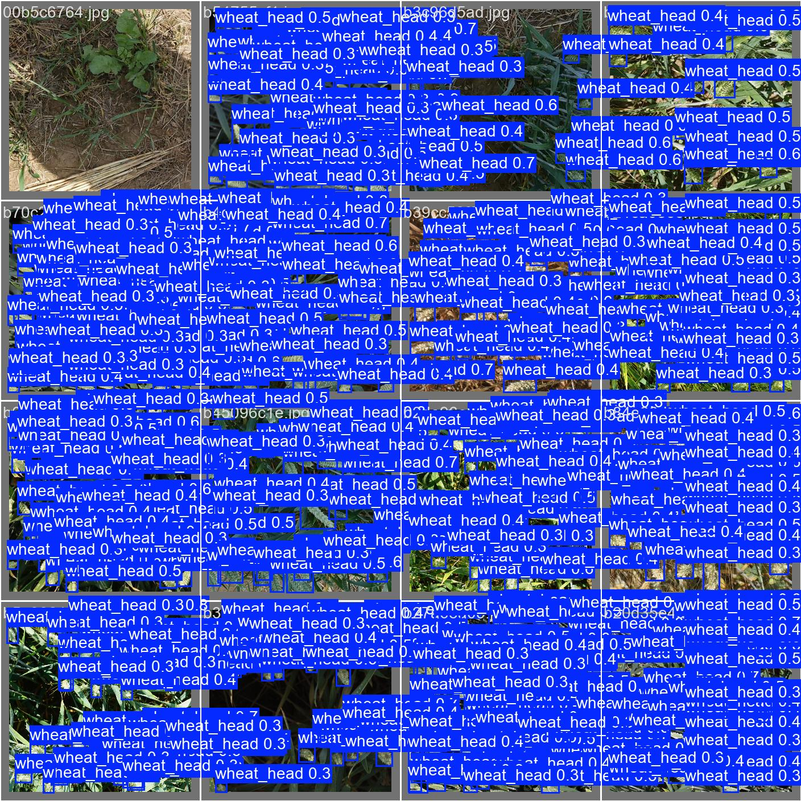
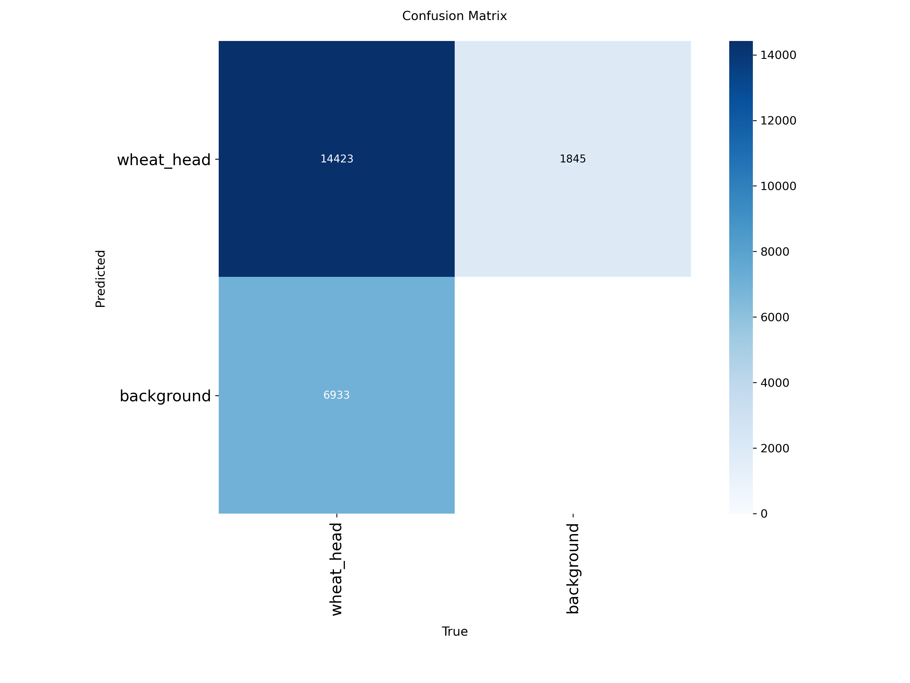
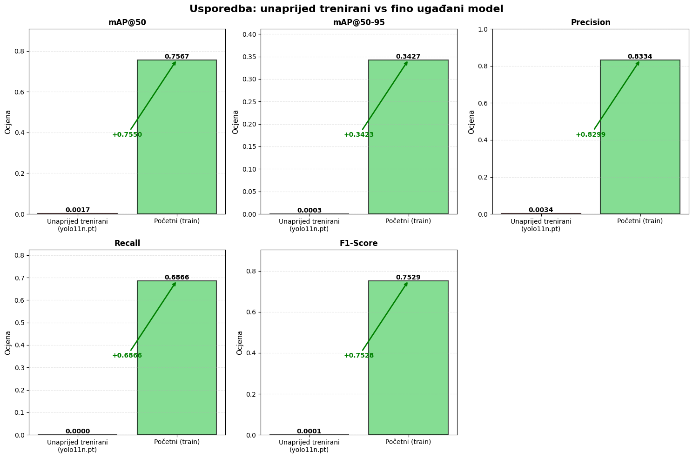

# Wheat Head Detection

This project detects wheat heads in field images using YOLO. I trained a YOLO11 model on labeled wheat images so it can find and draw boxes around wheat heads in photos.

The project is inspired by the [Global Wheat Detection competition on Kaggle](https://www.kaggle.com/competitions/global-wheat-detection). This is a university assignment — the code is vibe coded, just experimenting and learning concepts, not production-ready.

## Results

**Prediction example**

**Confusion matrix**

**Training curves (fine-tuning)** — precision, recall, mAP@50, and mAP@50-95 over epochs for the YOLO11 fine-tuned model on the wheat dataset.

---

A longer, step-by-step description of what was done and why (in **Croatian**) is in [seminar.md](seminar.md).
